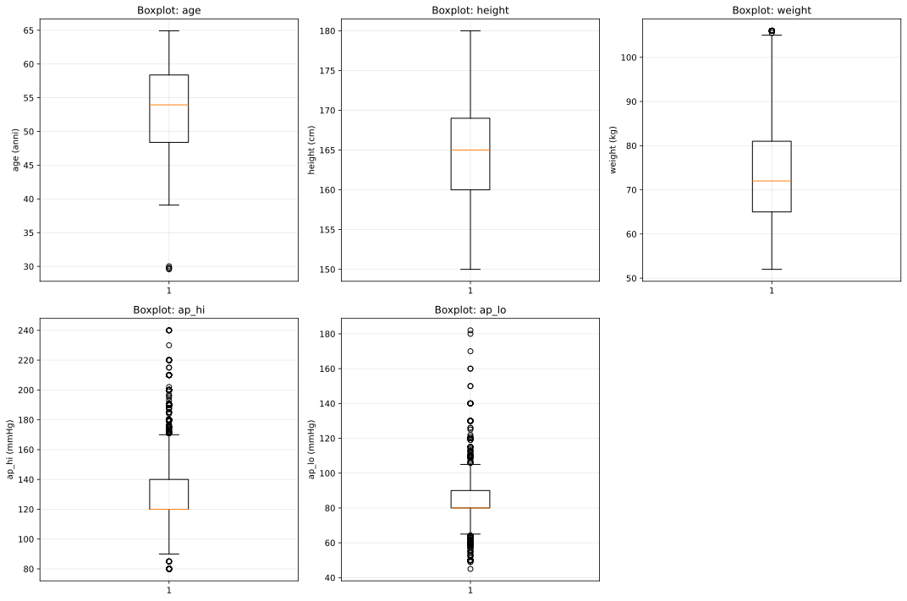
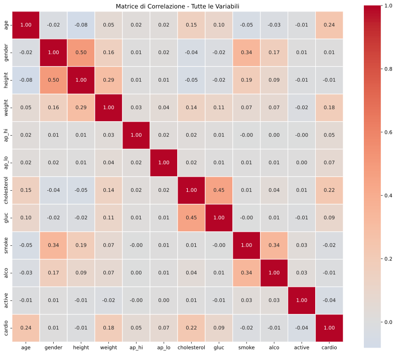
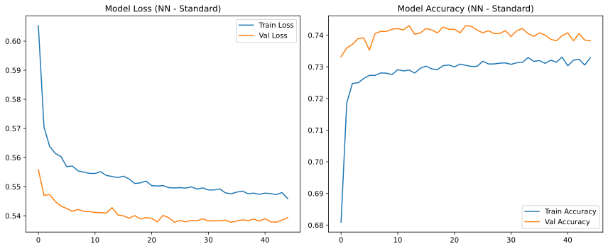
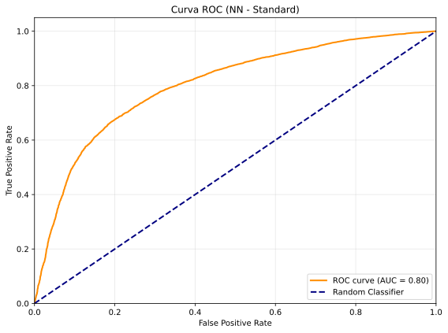
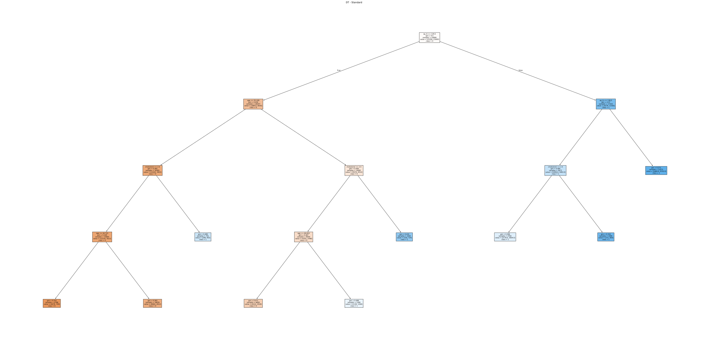
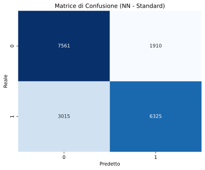
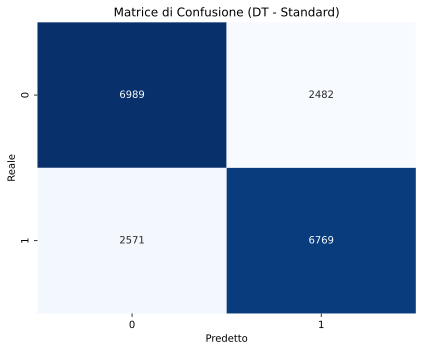
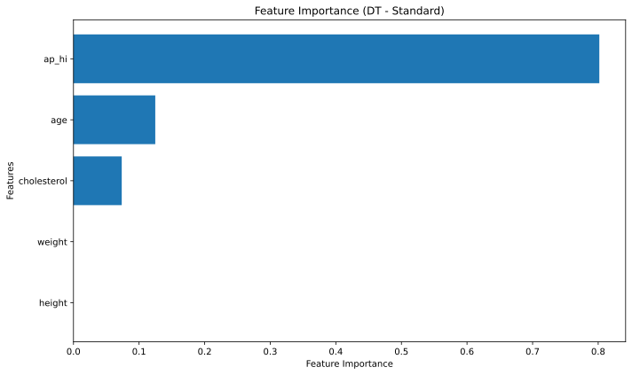

# Cardiovascular Disease Prediction

[](https://www.python.org/)
[](https://tensorflow.org/)
[](https://scikit-learn.org/)
[](https://pandas.pydata.org/)
[]()

> A machine learning project designed to predict the presence of cardiovascular disease (CVD) and identify critical risk factors using clinical examination data and patient lifestyle habits.

---

## 📋 Table of Contents
- [Project Overview](#-project-overview)
- [Dataset](#-dataset)
- [Data Preprocessing & Exploratory Analysis](#-data-preprocessing--exploratory-analysis)
- [Machine Learning Models](#-machine-learning-models)
  - [Artificial Neural Network (MLP)](#1-artificial-neural-network-mlp)
  - [Decision Tree Classifier (CART)](#2-decision-tree-classifier-cart)
- [Results & Performance Comparison](#-results--performance-comparison)
- [Key Insights & Feature Importance](#-key-insights--feature-importance)
- [Repository Structure](#-repository-structure)
- [Getting Started](#-getting-started)
- [Authors](#-authors)

---

## 🩺 Project Overview

Cardiovascular diseases (CVDs) remain the leading cause of mortality worldwide. Early detection of potential cardiovascular risks through non-invasive clinical indicators can significantly improve patient outcomes and healthcare intervention strategies.

This project implements an end-to-end machine learning pipeline to:
1. Conduct extensive **exploratory data analysis (EDA)**, outlier detection, and physiological validation on cardiovascular records.
2. Train and optimize a **Multilayer Perceptron (Artificial Neural Network)** with regularization and early stopping.
3. Train, prune, and interpret a **Decision Tree Classifier** using exhaustive grid search cross-validation.
4. Evaluate both standard and **class-weighted** configurations to address potential class imbalances.
5. Provide actionable clinical interpretability via feature importance and decision path inspection.

---

## 📊 Dataset

The study utilizes the **Cardiovascular Disease Dataset** (comprising 70,000 patient records) sourced via Kaggle / UCI Machine Learning repository.

### Features
| Feature | Type | Unit / Encoding | Description |
| :--- | :--- | :--- | :--- |
| `age` | Numerical | Years (converted from days) | Patient age |
| `gender` | Binary | `0`: Female, `1`: Male | Biological sex |
| `height` | Numerical | Meters (converted from cm) | Patient height |
| `weight` | Numerical | Kilograms (kg) | Patient weight |
| `ap_hi` | Numerical | mmHg | Systolic blood pressure |
| `ap_lo` | Numerical | mmHg | Diastolic blood pressure |
| `cholesterol` | Ordinal | `1`: Normal, `2`: Above Normal, `3`: Well Above Normal | Serum cholesterol level |
| `gluc` | Ordinal | `1`: Normal, `2`: Above Normal, `3`: Well Above Normal | Blood glucose level |
| `smoke` | Binary | `0`: Non-smoker, `1`: Smoker | Smoking habit |
| `alco` | Binary | `0`: No, `1`: Yes | Alcohol intake |
| `active` | Binary | `0`: Inactive, `1`: Active | Physical activity |
| **`cardio`** | **Target** | `0`: Absence, `1`: Presence | **Cardiovascular disease presence** |

---

## 🧹 Data Preprocessing & Exploratory Analysis

### 1. Data Cleaning & Outlier Removal
Raw medical data frequently contains erroneous measurements. Physiological constraints and statistical filtering were applied:
- **Blood Pressure Boundaries**: Restricted to clinically plausible human ranges:
  - Systolic blood pressure: $50 < \text{ap\_hi} \le 250\text{ mmHg}$
  - Diastolic blood pressure: $30 < \text{ap\_lo} \le 200\text{ mmHg}$
  - Physiological consistency: $\text{ap\_hi} > \text{ap\_lo}$
- **Height & Weight Boundaries**: Removed extreme statistical outliers outside the 2.5% and 97.5% quantiles.
- **Dataset Size**: Reduced from **70,000** to **62,703** high-confidence patient samples (~10.4% outlier removal).

<p align="center">
  
</p>

### 2. Feature Engineering & Scaling
- **Neural Network pipeline**:
  - Ordinal features (`cholesterol`, `gluc`) converted via **One-Hot Encoding** (avoiding false linearity assumptions).
  - Continuous numerical features (`age`, `height`, `weight`, `ap_hi`, `ap_lo`) standardized via `StandardScaler`.
  - Binary and one-hot features preserved as $\{0, 1\}$.
- **Decision Tree pipeline**:
  - Features preserved on their original non-standardized scales for optimal clinical decision tree readability and natural threshold interpretability.
- **Data Splitting**: Stratified 70/30 train-test split (43,892 training samples, 18,811 test samples).

<p align="center">
  
</p>

---

## 🤖 Machine Learning Models

### 1. Artificial Neural Network (MLP)
Implemented using **TensorFlow / Keras** with a sequential feedforward architecture designed to prevent overfitting:
- **Input Layer**: 13 input features (scaled numerical + binary + one-hot).
- **Hidden Layer 1**: 64 neurons, ReLU activation, Dropout rate of 0.3.
- **Hidden Layer 2**: 32 neurons, ReLU activation, Dropout rate of 0.3.
- **Output Layer**: 1 neuron, Sigmoid activation function.
- **Compilation**: Binary Cross-Entropy loss, Adam optimizer.
- **Regularization**: `EarlyStopping` (monitoring `val_loss`, patience = 20 epochs, restoring best weights).
- **Variants Tested**:
  - Standard training
  - Balanced Class Weights (`compute_class_weight`)

<p align="center">
  
  
</p>

### 2. Decision Tree Classifier (CART)
Trained using **Scikit-Learn** with exhaustive hyperparameter tuning via **5-Fold Cross-Validation Grid Search** (evaluating 960 candidate combinations, 4,800 fits):
- **Tuned Hyperparameters**:
  - `criterion`: `['gini', 'entropy', 'log_loss']`
  - `max_depth`: `[3, 4, 5, 6, 7, 8, 10, None]`
  - `min_samples_split`: `[2, 5, 10, 20]`
  - `min_samples_leaf`: `[1, 2, 4, 8]`
  - `ccp_alpha`: `[0.0, 0.001, 0.005, 0.01, 0.02]` (Cost-Complexity Pruning)
- **Optimal Hyperparameters**:
  - `criterion`: `'gini'`
  - `max_depth`: `4`
  - `ccp_alpha`: `0.001`
  - Resulting structure: Pruned tree of depth 4 with 9 terminal leaves, maximizing generalization and preventing overfitting.

<p align="center">
  
</p>

---

## 📈 Results & Performance Comparison

Both models demonstrated robust generalization on the 18,811 hold-out test samples:

| Model | Variant | Test Accuracy | Precision (CVD) | Recall (CVD) | F1-Score (CVD) | ROC-AUC |
| :--- | :--- | :---: | :---: | :---: | :---: | :---: |
| **Neural Network (MLP)** | Standard | **73.66%** | **0.77** | 0.68 | 0.72 | **0.8023** |
| **Neural Network (MLP)** | Class Weights | 73.54% | 0.75 | **0.70** | **0.73** | 0.8019 |
| **Decision Tree** | Standard | 73.14% | 0.73 | 0.72 | 0.73 | ~0.785 |
| **Decision Tree** | Class Weights | 73.14% | 0.73 | 0.72 | 0.73 | ~0.785 |

### Confusion Matrices
<p align="center">
  
  
</p>

---

## 🔍 Key Insights & Feature Importance

From the Decision Tree feature importance and exploratory analysis:
1. **Systolic Blood Pressure (`ap_hi`)** is by far the most dominant risk indicator, accounting for **~80%** of total feature importance in the decision splits.
2. **Age (`age`)** is the second most critical factor (~**12.5%** importance), showing a consistent positive correlation with cardiovascular pathology.
3. **Cholesterol Level (`cholesterol`)** represents ~**7.4%** of tree split importance, with elevated levels significantly shifting risk probabilities.
4. Other lifestyle factors (smoking, alcohol, physical activity) showed lower direct splitting importance when conditioned on blood pressure, confirming that their primary clinical impact is mediated through hypertension and metabolic health.

<p align="center">
  
</p>

---

## 📁 Repository Structure

```text
├── dataset/
│   └── cardio_train.csv          # Raw cardiovascular dataset (70,000 samples)
├── images/                       # Generated SVG plots and diagrams
│   ├── boxplots_before_cleaning.svg
│   ├── outliers_boxplots_cleaned.svg
│   ├── distributions_curves.svg
│   ├── distributions_comparison_curves.svg
│   ├── correlation_matrix.svg
│   ├── nn_training_curves_*.svg
│   ├── nn_roc_curve_*.svg
│   ├── nn_confusion_matrix_*.svg
│   ├── dt_dt_*.svg
│   ├── dt_confusion_matrix_*.svg
│   └── dt_feature_importance_*.svg
├── ML_Project.ipynb              # Complete end-to-end Jupyter Notebook
├── README.md                     # Project documentation
├── README.txt                    # Authors and matricola IDs
└── requirements.txt              # Python package dependencies
```

---

## 🚀 Getting Started

### Prerequisites
- Python 3.10 or higher
- Jupyter Notebook / JupyterLab or VS Code

### Installation
1. Clone the repository:
   ```bash
   git clone https://github.com/mbroglio/cardiovascular-disease-prediction.git
   cd cardiovascular-disease-prediction
   ```

2. Create and activate a virtual environment (optional but recommended):
   ```bash
   python3 -m venv venv
   source venv/bin/activate   # On Windows: venv\Scripts\activate
   ```

3. Install required dependencies:
   ```bash
   pip install -r requirements.txt
   ```

4. Launch Jupyter and run the notebook:
   ```bash
   jupyter notebook ML_Project.ipynb
   ```

---

## 👥 Authors

Project developed for the **Machine Learning** course (Academic Year 2025/2026):

- **Matteo Broglio** - Matricola: `899562`
- **Lorenzo Caputo** - Matricola: `894528`
- **Daniel Giuggioli** - Matricola: `894415`
